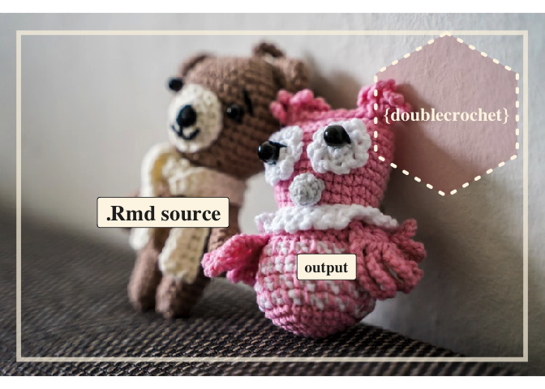

<!-- README.md is generated from README.Rmd. Please edit that file -->

# Introducing *{doublecrochet}*



<!-- badges: start -->

[](https://www.tidyverse.org/lifecycle/#experimental)
<!-- badges: end -->

Rmarkdown files are so cool. They let you to combine prose, code, and
code output in a *single* output file. And getting up and running with
.Rmds is pretty easy — learn bit about code chunks, a bit of markdown
and you are good to go.

But there is a lot that you can do in .Rmds beyond the basics. So you
may feel .Rmd admiration and wonder at the products of more advanced
users. How did they to *that*?

Or maybe as an advanced user you might get asked: *How did you produce
those slides, poster, dashboard etc.?* You can answer ‘xaringan’ or
‘knitr’, but can you deliver ‘the how-to goods’ in a detailed way when
you get this question? (Another common sensation, looking back at your
own work, may be ‘how did I get that done?’)

The goal of doublecrochet is to help produce a complementary output from
your .Rmd – one that has .Rmd source snippets quoted close to the
rendered output.

The package is experimental, and now focused a case where there are
natural breakpoints – slideshows! Quoted source is presented on a slide,
then the rendered content is shown.

Check out doublecrochet’s in action below. The first set of slides is a
slide show of ‘Cool Xaringan Stuff’, and the second is the Double
Crochetted version that quotes the slide source.

## *Compare* …

### Cool Xaringan Stuff <a href="https://evamaerey.github.io/doublecrochet/cool_xaringan_stuff.html" target="_blank">Open in New tab</a>

<div style="position:relative;padding-top:56.25%;">

<iframe src="https://evamaerey.github.io/doublecrochet/cool_xaringan_stuff.html" frameborder="2" webkitallowfullscreen mozallowfullscreen allowfullscreen style="position:absolute;top:0;left:0;width:100%;height:100%;" allowtransparency="true">
</iframe>

</div>

## *… with the Double Crocheted version*

### Cool Xaringan Stuff *Double Crocheted* <a href="https://evamaerey.github.io/doublecrochet/cool_xaringan_stuff_double_crochet.html" target="_blank">View in new tab</a>:

<div style="position:relative;padding-top:56.25%;">

<iframe src="https://evamaerey.github.io/doublecrochet/cool_xaringan_stuff_double_crochet.html" frameborder="2" webkitallowfullscreen mozallowfullscreen allowfullscreen style="position:absolute;top:0;left:0;width:100%;height:100%;" allowtransparency="true">
</iframe>

</div>

## Motivation

Inspiration for this project was creating [Easy Flipbooks
Recipes](https://evamaerey.github.io/flipbooks/flipbook_recipes#1) where
I was quoting my source a bunch w/ copy paste and fancy fencing. I only
got through 4 ‘recipes’. But there were more ‘recipes’ that I’d like to
share.

Having ‘doublecrochet’ working should be nice for communicating about
how to use flipbookr – and other cool xaringan-complementary packages.

## Installation

<!-- You can install the released version of doublecrochet from [CRAN](https://CRAN.R-project.org) with: -->
<!-- ``` r -->
<!-- install.packages("doublecrochet") -->
<!-- ``` -->

And the development version from [GitHub](https://github.com/) with:

``` r
# install.packages("remotes")
remotes::install_github("EvaMaeRey/doublecrochet")
```

## Example

For now doublecrochet::crochet() is intended for use with xaringan .Rmd
slide show files:

``` r
library(doublecrochet)

## a text .rmd file stored on github
download.file(
  url = "https://raw.githubusercontent.com/EvaMaeRey/doublecrochet/master/inst/rmarkdown/templates/double-crochet/skeleton/skeleton.Rmd", 
  destfile = "docs/cool_xaringan_stuff.Rmd")

# regular render of xaringan .Rmd 
rmarkdown::render(input = "docs/cool_xaringan_stuff.Rmd")

# double crochet render
doublecrochet::crochet(input = "docs/cool_xaringan_stuff.Rmd", render = T)
                      
```

Once you have the ‘doublecrochet’ version of your .Rmd, you can try to
compile and render this and you’ll have html output. Source will be
quoted throughout.

## Bugs

Backslashing is still being worked out. Especially sad is that math mode
doesn’t work well because of this. :-( I see this “–from
markdown+autolink\_bare\_uris+tex\_math\_single\_backslash” in pandoc
conversion upon render. Maybe the answer is in there…

We see this with the xaringan template below.

``` r
library(doublecrochet)

download.file("https://raw.githubusercontent.com/yihui/xaringan/master/inst/rmarkdown/templates/xaringan/skeleton/skeleton.Rmd", "xaringan_skeleton.Rmd")

crochet("xaringan_skeleton.Rmd")

# fails!  you've got to go into the .Rmd and fix up backslashes

# in fact for the math type the conversion is not working, you have to go back in and escape
# rmarkdown::render("xaringan_skeleton_double_crochet.Rmd")
```

## Scope

Doublecrochet doesn’t do a good job of showing bigger picture and global
style changes in a file.
